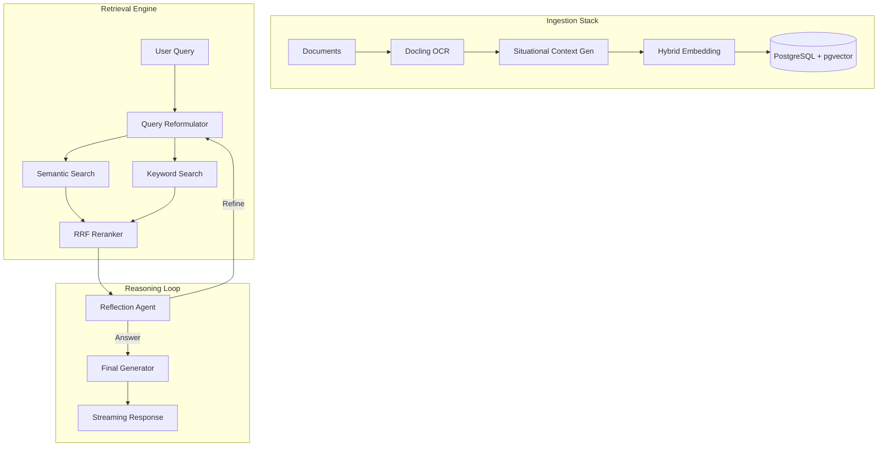

# 🚀 Enterprise Hybrid RAG Platform

> A production-grade, locally-deployable Hybrid Retrieval Augmented Generation (RAG) system featuring **Contextual Retrieval**, **Reciprocal Rank Fusion (RRF)**, and **Agentic Orchestration**.

[](https://www.python.org/downloads/)
[](https://github.com/langchain-ai/langgraph)
[](https://github.com/pgvector/pgvector)

---

## 🎯 Overview

The **Enterprise Hybrid RAG Platform** is a sophisticated AI system designed for high-precision document retrieval and reasoning. It implements industry-leading techniques like Anthropic's **Contextual Retrieval** and **Reciprocal Rank Fusion (RRF)** to ensure answers are grounded in both semantic meaning and exact keyword matches.

### Core Capabilities

- **🔍 Hybrid Search**: Merges dense semantic retrieval (pgvector) with sparse keyword retrieval (tsvector) using RRF for superior accuracy.
- **🧠 Contextual Retrieval**: Automatically generates situational context for document chunks using local LLMs, enriching embeddings with document-level awareness.
- **🤖 Agentic Orchestration**: Built on **LangGraph**, the system features self-reflective loops, query rewriting, and iterative refinement.
- **🔒 Local-First & Privacy-Focused**: Runs entirely on your infrastructure using **Ollama** for model inference and **PostgreSQL** for storage.
- **📄 Advanced Ingestion**: Powered by **IBM's Docling**, providing high-fidelity OCR and layout analysis for complex PDFs and documents.

---

## 🏗️ Architecture



---

## 📁 Project Structure

The project follows a standard `src/` layout for modularity and scalability:

```text
enterprice_rag/
├── main.py                 # Application launcher (API/UI)
├── pyproject.toml          # Dependency & build configuration
├── src/
│   └── enterprice_rag/
│       ├── agents/         # LangGraph agents & state machines
│       ├── api/            # FastAPI REST endpoints (streaming support)
│       ├── config/         # Centralized system settings
│       ├── ingestion/      # Document parsing & OCR logic
│       ├── processing/     # Core RAG: embedding, reranking, hybrid search
│       ├── storage/        # Database models & vector store interactions
│       ├── ui/             # Gradio-based multi-tab interface
│       └── utils/          # Shared helper utilities
└── infrastructure/
    └── pgvector_source/    # Local pgvector source code
```

---

## 🚀 Getting Started

### Prerequisites

- **Python 3.12+**
- **PostgreSQL 14+** with the `pgvector` extension
- **Ollama** for running local LLMs

### Installation

1. **Clone and Install**
   ```bash
   git clone https://github.com/yourusername/enterprice_rag.git
   cd enterprice_rag
   pip install -e .
   ```

2. **Database Setup**
   ```bash
   # Ensure PostgreSQL is running and create the database
   createdb rag
   psql rag -c "CREATE EXTENSION IF NOT EXISTS vector;"
   ```

3. **Model Preparation (Ollama)**
   ```bash
   ollama pull granite4:latest            # For generation
   ollama pull phi4-mini-reasoning:3.8b   # For context generation
   ollama pull qwen3:4b                   # For agentic tasks
   ```

---

## 💻 Usage

### Launching the System

#### Option 1: Web Interface (Gradio)
Access a user-friendly UI for ingestion and chat at `http://localhost:7860`.
```bash
python -m enterprice_rag.ui.app
```

#### Option 2: REST API (FastAPI)
Deploy a high-performance API with streaming chat support.
```bash
python main.py
```

### Programmatic Access
```python
from enterprice_rag.agents.langgraph_agent import run_agent

# Stream responses from the agentic RAG loop
for chunk in run_agent("What are the key technical specifications?"):
    print(chunk, end="", flush=True)
```

---

## 🛠️ Technology Stack

- **Orchestration**: [LangGraph](https://github.com/langchain-ai/langgraph)
- **Document Parsing**: [Docling](https://github.com/DS4SD/docling)
- **Vector Search**: [pgvector](https://github.com/pgvector/pgvector)
- **Inference Server**: [Ollama](https://ollama.ai/)
- **API Engine**: [FastAPI](https://fastapi.tiangolo.com/)
- **UI Framework**: [Gradio](https://gradio.app/)

---

## 📊 Performance & Privacy

- **Retrieval**: Sub-100ms vector search within local PostgreSQL.
- **Privacy**: No external API calls required (except optional cloud embeddings). All data remains local.
- **Accuracy**: RRF reranking significantly reduces hallucinations by grounding the LLM in verified document segments.

---

<div align="center">
Built with ❤️ for High-Precision Enterprise RAG
</div>
