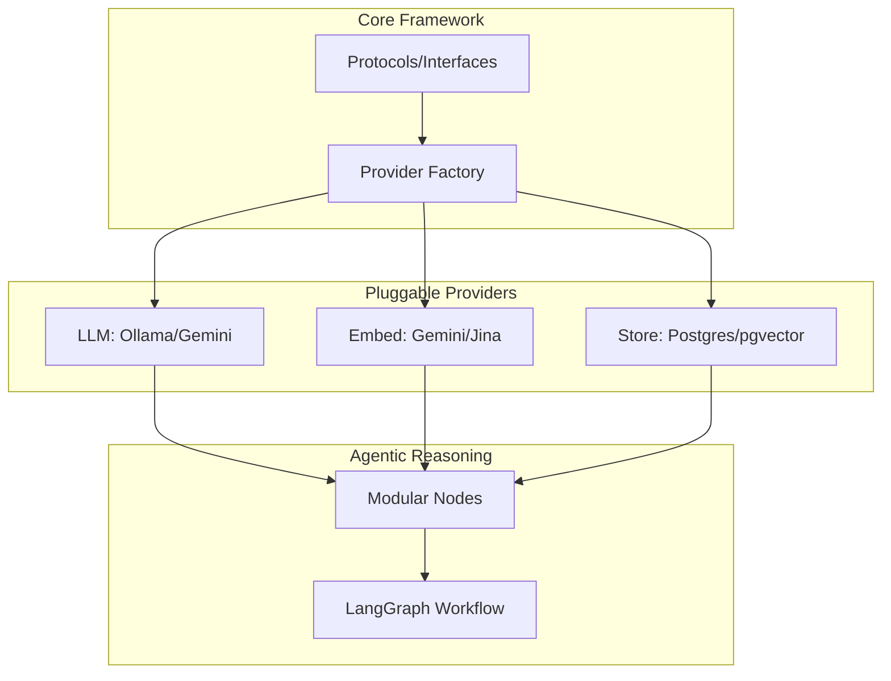

# 🚀 Enterprise Hybrid RAG Platform

> A production-grade, locally-deployable Hybrid Retrieval Augmented Generation (RAG) system featuring **Modular Provider Architecture**, **Contextual Retrieval**, and **Agentic Orchestration**.

[](https://www.python.org/downloads/)
[](https://github.com/langchain-ai/langgraph)
[](https://github.com/pgvector/pgvector)
[](https://github.com/astral-sh/uv)

---

## 🎯 Overview

The **Enterprise Hybrid RAG Platform** is a sophisticated AI system designed for high-precision document retrieval and reasoning. It features a fully **modular architecture** that allows you to swap LLMs, Embedding models, and Vector Stores with zero changes to the core agent logic.

### Core Capabilities

- **🧩 Modular Provider Design**: Decoupled interfaces for LLMs (Ollama), Embeddings (Gemini), and Storage (Postgres) using the Provider Pattern.
- **🔍 Hybrid Search**: Merges dense semantic retrieval (pgvector) with sparse keyword retrieval (tsvector) using Reciprocal Rank Fusion (RRF).
- **🧠 Contextual Retrieval**: Automatically generates situational context for document chunks, enriching embeddings with document-level awareness.
- **🤖 Agentic Orchestration**: Built on **LangGraph**, featuring self-reflective loops, query rewriting, and iterative refinement.
- **📄 Advanced Ingestion**: High-fidelity OCR and layout analysis for complex documents via **Docling**.

---

## 🏗️ Architecture



---

## 📁 Project Structure

```text
enterprice_rag/
├── src/
│   └── enterprice_rag/
│       ├── core/           # Interfaces (Protocols) & Provider Factory
│       ├── providers/      # Pluggable implementations (LLM, Embeddings, Storage)
│       ├── agents/
│       │   └── rag_agent/  # Modular LangGraph (state, nodes, graph)
│       ├── api/            # FastAPI REST endpoints
│       ├── ingestion/      # Document parsing & OCR logic
│       ├── processing/     # Modular chunking & retrieval wrappers
│       ├── storage/        # DB models & ingestion pipeline
│       ├── ui/             # Gradio-based interface
│       └── utils/          # Shared utilities
├── main.py                 # API Launcher
└── pyproject.toml          # UV configuration
```

---

## 🚀 Getting Started

### Prerequisites

- **Python 3.12+**
- **uv** package manager
- **PostgreSQL 14+** with `pgvector`
- **Ollama** (for local LLMs)

### Installation

1. **Clone and Sync**
   ```bash
   git clone https://github.com/yourusername/enterprice_rag.git
   cd enterprice_rag
   uv sync
   ```

2. **Database Setup**
   ```bash
   createdb rag
   psql rag -c "CREATE EXTENSION IF NOT EXISTS vector;"
   ```

### Configuration
Edit `src/enterprice_rag/config/settings.py` to configure your database URL, model selections, and API keys.

---

## 💻 Usage

### Launching the System

#### Option 1: Web Interface (Gradio)
```bash
PYTHONPATH=src uv run python src/enterprice_rag/ui/app.py
```

#### Option 2: REST API (FastAPI)
```bash
uv run python main.py
```

### Programmatic Access
```python
from enterprice_rag.agents.rag_agent.graph import run_agent

# Stream responses from the modular agentic loop
for chunk in run_agent("What are the key instructions for tenderers?"):
    print(chunk, end="", flush=True)
```

---

## 🛠️ Technology Stack

- **Orchestration**: [LangGraph](https://github.com/langchain-ai/langgraph)
- **Package Manager**: [uv](https://github.com/astral-sh/uv)
- **Document Parsing**: [Docling](https://github.com/DS4SD/docling)
- **Vector Search**: [pgvector](https://github.com/pgvector/pgvector)
- **Inference**: [Ollama](https://ollama.ai/)
- **UI Framework**: [Gradio](https://gradio.app/)

---

<div align="center">
Built with ❤️ for Modular Enterprise RAG
</div>
