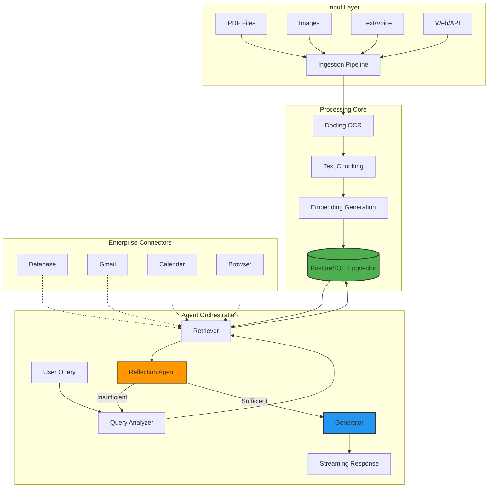

# 🚀 Enterprise RAG System

> A production-grade, locally-deployable Retrieval Augmented Generation (RAG) system with multi-modal capabilities, agentic orchestration, and enterprise connectivity.

[](https://www.python.org/downloads/)
[](https://github.com/langchain-ai/langgraph)
[](https://github.com/pgvector/pgvector)
[](LICENSE)

---

## 📋 Table of Contents

- [Overview](#-overview)
- [Key Features](#-key-features)
- [Architecture](#-architecture)
- [Technology Stack](#-technology-stack)
- [Project Structure](#-project-structure)
- [Getting Started](#-getting-started)
- [Usage](#-usage)
- [System Components](#-system-components)
- [Roadmap](#-roadmap)
- [Contributing](#-contributing)

---

## 🎯 Overview

This **Enterprise RAG System** is a sophisticated, modular AI platform designed for secure, local deployment with enterprise-grade capabilities. It combines cutting-edge retrieval augmented generation with agentic workflows, multi-modal processing, and seamless integration with enterprise resources.

### What Makes This Special?

- **🔒 Privacy-First**: Runs entirely locally with no data leaving your infrastructure
- **🤖 Agentic Architecture**: Self-reflective agents with query rewriting and iterative refinement
- **🎨 Multi-Modal**: Processes PDFs, images, text, voice, and web content
- **🔌 Enterprise Ready**: Built-in connectors for databases, email, calendar, and browser automation
- **⚡ High Performance**: Vector-based semantic search with pgvector for sub-second retrieval
- **🧩 Modular Design**: Plug-and-play architecture for easy extension and customization

---

## ✨ Key Features

### 🧠 Intelligent Agent System
- **Self-Reflective Agents**: Automatically evaluates answer quality and refines queries
- **Query Rewriting**: Optimizes search queries for better retrieval accuracy
- **Iterative Refinement**: Multi-pass retrieval with reflection loops (max 2 iterations)
- **Streaming Responses**: Real-time answer generation with LLM streaming

### 📚 Multi-Modal Document Processing
- **PDF Ingestion**: Advanced OCR with Docling for scanned documents
- **Image Processing**: Vision-Language Models (VLM) for image understanding
- **Voice Input**: Speech-to-Text (STT) integration for hands-free operation
- **Web Scraping**: Browser automation for dynamic content extraction

### 🔍 Advanced Retrieval
- **Semantic Search**: Vector embeddings with pgvector for contextual retrieval
- **Hybrid Search**: Combines semantic and keyword-based search
- **Configurable Top-K**: Adjustable result count for precision/recall balance
- **Source Attribution**: Tracks and cites source documents in responses

### 🌐 Enterprise Connectivity
- **Database Integration**: Direct SQL query execution and data retrieval
- **Gmail Connector**: Read, send, and organize emails programmatically
- **Calendar Integration**: Schedule and manage events automatically
- **Browser Automation**: Headless browser for web interactions

### 💻 User Interfaces
- **Gradio Web UI**: Beautiful, interactive chat interface with file upload
- **REST API**: FastAPI-based endpoints for programmatic access
- **CLI Support**: Command-line interface for batch processing

---

## 🏗️ Architecture



### Data Flow

1. **Ingestion**: Multi-modal inputs are processed through specialized parsers (PDF, OCR, STT)
2. **Storage**: Text is chunked, embedded, and stored in PostgreSQL with vector indices
3. **Query Analysis**: User queries are analyzed and rewritten for optimal retrieval
4. **Retrieval**: Semantic search finds the most relevant document chunks
5. **Reflection**: Agent evaluates if retrieved context is sufficient
6. **Generation**: LLM generates answers with streaming output
7. **Iteration**: If needed, query is refined and process repeats (max 2 cycles)

---

## 🛠️ Technology Stack

### Core Framework
- **[LangGraph](https://github.com/langchain-ai/langgraph)** - Agentic workflow orchestration with state management
- **[LangChain](https://github.com/langchain-ai/langchain)** - LLM application framework
- **[Google ADK](https://developers.google.com/adk)** - Advanced agent development kit

### AI/ML
- **[Ollama](https://ollama.ai/)** - Local LLM inference (Llama, Qwen, etc.)
- **[Docling](https://github.com/DS4SD/docling)** - Advanced document OCR and layout analysis
- **Whisper** - Speech-to-Text for voice processing
- **Vision-Language Models** - Multi-modal understanding

### Data Storage
- **[PostgreSQL](https://www.postgresql.org/)** - Primary database
- **[pgvector](https://github.com/pgvector/pgvector)** - Vector similarity search extension
- **[psycopg](https://www.psycopg.org/)** - PostgreSQL adapter for Python

### Web & API
- **[FastAPI](https://fastapi.tiangolo.com/)** - High-performance REST API
- **[Gradio](https://gradio.app/)** - Interactive web UI
- **[Uvicorn](https://www.uvicorn.org/)** - ASGI server

### Enterprise Connectors
- **MCP Framework** - Model Context Protocol for enterprise integrations
- **Selenium/Playwright** - Browser automation
- **Gmail API** - Email integration
- **Calendar APIs** - Schedule management

---

## 📁 Project Structure

```
enterprice_rag/
│
├── 📂 agents/                    # Agentic orchestration layer
│   ├── supervisor.py            # Multi-agent coordinator
│   ├── langgraph_agent.py       # Main RAG agent with reflection
│   ├── agent_protocol.py        # Agent communication protocol
│   ├── reflection_agent.py      # Self-evaluation agent
│   ├── react_agent.py           # ReAct pattern implementation
│   └── memory_manager.py        # Conversation history & context
│
├── 📂 ingestion/                 # Multi-modal input processing
│   ├── pdf_ingest.py            # PDF parsing with Docling
│   ├── voice_ingest.py          # Speech-to-Text processing
│   └── image_ingest.py          # OCR and vision processing
│
├── 📂 processing/                # RAG core components
│   ├── embedder.py              # Text embedding generation
│   ├── retriever.py             # Semantic search engine
│   ├── llm_infer.py             # LLM inference with streaming
│   └── rag_chain.py             # End-to-end RAG pipeline
│
├── 📂 storage/                   # Data persistence layer
│   ├── postgres_client.py       # Database connection manager
│   └── vector_store.py          # Vector operations & indexing
│
├── 📂 connectivity/              # Enterprise integrations
│   ├── db_connector.py          # Database query executor
│   ├── gmail_connector.py       # Email automation
│   ├── calendar_connector.py    # Calendar management
│   └── browser_automation.py    # Web scraping & automation
│
├── 📂 multimodal/                # Multi-modal capabilities
│   ├── vision_agent.py          # Image understanding
│   ├── stt_agent.py             # Voice-to-text
│   └── voice_activation.py      # Wake word detection
│
├── 📂 api/                       # REST API layer
│   ├── main.py                  # FastAPI application
│   ├── routes/                  # API endpoints
│   └── schemas.py               # Pydantic models
│
├── 📂 ui/                        # User interfaces
│   └── app.py                   # Gradio web interface
│
├── 📂 config/                    # Configuration management
│   ├── settings.py              # Application settings
│   └── secrets.toml             # Credentials (gitignored)
│
├── 📂 utils/                     # Utility functions
│   └── excel_writer.py          # Query logging to CSV
│
├── 📂 tests/                     # Unit & integration tests
│
├── 📂 pgvector/                  # PostgreSQL extension
│
├── 📄 main.py                    # Application entry point
├── 📄 pyproject.toml             # Project dependencies
├── 📄 rag_flow.md                # Architecture documentation
├── 📄 rag_stack.md               # Technology stack guide
└── 📄 README.md                  # This file
```

---

## 🚀 Getting Started

### Prerequisites

- **Python 3.12+**
- **PostgreSQL 14+** with pgvector extension
- **Ollama** (for local LLM inference)
- **UV** package manager (recommended) or pip

### Installation

1. **Clone the repository**
   ```bash
   git clone https://github.com/yourusername/enterprice_rag.git
   cd enterprice_rag
   ```

2. **Install dependencies**
   ```bash
   # Using UV (recommended)
   uv sync
   
   # Or using pip
   pip install -e .
   ```

3. **Set up PostgreSQL with pgvector**
   ```bash
   # Install pgvector extension
   cd pgvector
   make
   sudo make install
   
   # Create database
   createdb rag_db
   psql rag_db -c "CREATE EXTENSION vector;"
   ```

4. **Configure environment**
   ```bash
   # Copy example config
   cp config/secrets.toml.example config/secrets.toml
   
   # Edit with your credentials
   nano config/secrets.toml
   ```

5. **Install Ollama and pull models**
   ```bash
   # Install Ollama (see https://ollama.ai)
   curl -fsSL https://ollama.ai/install.sh | sh
   
   # Pull required models
   ollama pull llama3.2
   ollama pull qwen2.5
   ollama pull nomic-embed-text
   ```

### Quick Start

#### Option 1: Web UI (Gradio)
```bash
python ui/app.py
```
Navigate to `http://localhost:7860` to access the chat interface.

#### Option 2: REST API
```bash
python main.py
```
API will be available at `http://localhost:8000`. Visit `/docs` for interactive API documentation.

#### Option 3: Direct Agent Execution
```python
from agents.langgraph_agent import run_agent

# Stream responses
for chunk in run_agent("What are the key findings in the report?"):
    print(chunk, end="", flush=True)
```

---

## 💡 Usage

### Ingesting Documents

#### Via Web UI
1. Navigate to the **"Ingest File"** tab
2. Upload one or more PDF files
3. Wait for processing confirmation
4. Switch to **"Chat"** tab to query

#### Via Python API
```python
from ingestion.pdf_ingest import docling_ocr
from storage.vector_store import process_document
from storage.postgres_client import SessionLocal

# Extract text from PDF
markdown_text = docling_ocr("path/to/document.pdf")

# Store in vector database
session = SessionLocal()
num_chunks = process_document("doc_id", markdown_text, session)
session.close()

print(f"Ingested {num_chunks} chunks")
```

### Querying the System

#### Interactive Chat
```python
from agents.langgraph_agent import run_agent

query = "Summarize the main conclusions"
for chunk in run_agent(query):
    print(chunk, end="", flush=True)
```

#### REST API
```bash
curl -X POST "http://localhost:8000/query" \
  -H "Content-Type: application/json" \
  -d '{"query": "What are the key findings?"}'
```

### Advanced Features

#### Custom Retrieval Parameters
```python
from processing.retriever import search
from storage.postgres_client import SessionLocal

session = SessionLocal()
results = search(session, "your query", top_k=10)
session.close()
```

#### Direct LLM Inference
```python
from processing.llm_infer import query_ollama_stream

prompt = "Explain quantum computing"
for chunk in query_ollama_stream(prompt):
    print(chunk, end="")
```

---

## 🔧 System Components

### Agent Workflow (LangGraph)

The system uses a **state machine** approach with the following nodes:

1. **Query Analyzer**: Rewrites user queries for better retrieval
2. **Retriever**: Performs semantic search against vector database
3. **Reflection**: Evaluates if retrieved context is sufficient
4. **Generator**: Produces final answer with LLM streaming

```python
# Simplified agent state
class AgentState(TypedDict):
    original_query: str
    rewritten_query: str
    context: List[Dict]
    answer: Any
    reflection: str
    iterations: int
```

### Reflection Loop

The agent can iterate up to **2 times** if initial retrieval is insufficient:

```
Query → Analyze → Retrieve → Reflect
                      ↑          ↓
                      └─ Refine ←┘ (if insufficient)
                           ↓
                      Generate Answer
```

### Optimized Prompts

All prompts are **concise and task-specific** for faster inference:

- **Query Rewrite**: "Rewrite this search query to be more specific..."
- **Reflection**: "Can this context answer the question? Reply only 'yes' or 'no'."
- **Generation**: "Answer based *only* on the provided context."

---

## 🗺️ Roadmap

### ✅ Completed
- [x] Core RAG pipeline with LangGraph
- [x] PostgreSQL + pgvector integration
- [x] PDF ingestion with Docling
- [x] Self-reflective agent with query rewriting
- [x] Streaming LLM responses
- [x] Gradio web UI
- [x] FastAPI REST endpoints
- [x] Query logging to CSV

### 🚧 In Progress
- [ ] Voice input/output integration
- [ ] Vision-Language Model support
- [ ] Enterprise connector implementations (Gmail, Calendar, DB)
- [ ] Browser automation module
- [ ] Multi-agent supervisor orchestration

### 🔮 Planned
- [ ] Fine-tuned embedding models
- [ ] Hybrid search (semantic + keyword)
- [ ] Multi-language support
- [ ] Advanced memory management
- [ ] Distributed deployment support
- [ ] Monitoring dashboard
- [ ] Comprehensive test suite
- [ ] Docker containerization

---

## 🤝 Contributing

Contributions are welcome! This project follows a **modular architecture** making it easy to add new features:

### Adding a New Agent
1. Create a new file in `agents/`
2. Implement the agent protocol interface
3. Register with the supervisor

### Adding a New Connector
1. Create a new file in `connectivity/`
2. Implement standard connector methods
3. Add configuration to `config/settings.py`

### Adding a New Ingestion Type
1. Create a new parser in `ingestion/`
2. Add to the ingestion pipeline
3. Update UI to accept new file types

---

## 📊 Performance

- **Retrieval Speed**: < 100ms for semantic search (10K documents)
- **Inference**: ~50 tokens/sec with Llama 3.2 (8B) on CPU
- **Embedding**: ~200 docs/sec with nomic-embed-text
- **End-to-End Query**: 2-5 seconds (including reflection)

---

## 🔐 Security & Privacy

- **Local-First**: All processing happens on your infrastructure
- **No External APIs**: Optional use of local models only
- **Credential Management**: Secrets stored in gitignored TOML files
- **Database Security**: PostgreSQL with standard authentication
- **API Security**: Token-based authentication (configurable)

---

## 📝 License

This project is licensed under the MIT License - see the [LICENSE](LICENSE) file for details.

---

## 🙏 Acknowledgments

- **LangChain Team** for the excellent agent framework
- **Ollama** for making local LLM inference accessible
- **pgvector** for high-performance vector search
- **Docling** for advanced document understanding
- **Gradio** for the beautiful UI framework

---

## 📧 Contact

For questions, suggestions, or collaboration opportunities:

- **GitHub Issues**: [Create an issue](https://github.com/yourusername/enterprice_rag/issues)
- **Email**: your.email@example.com
- **LinkedIn**: [Your Profile](https://linkedin.com/in/yourprofile)

---

<div align="center">

**Built with ❤️ for the AI community**

⭐ Star this repo if you find it useful!

</div>
