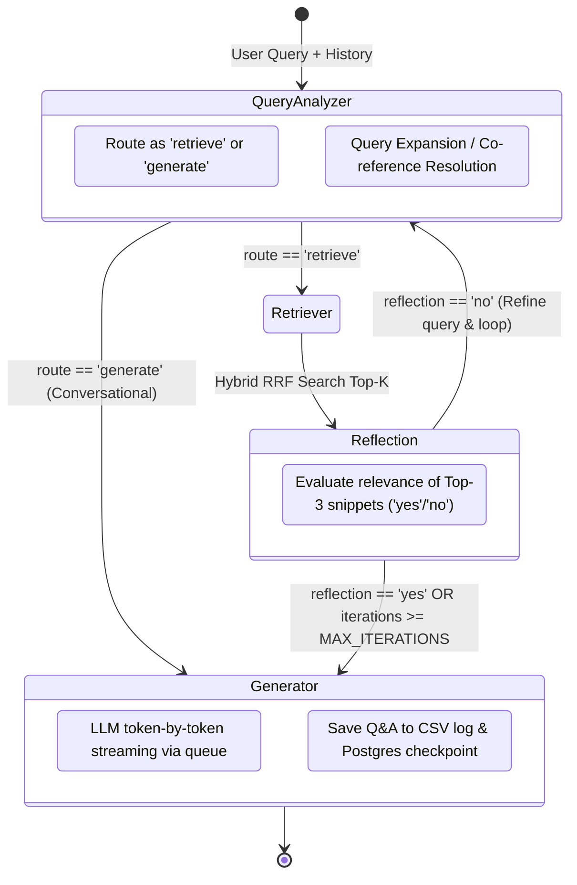
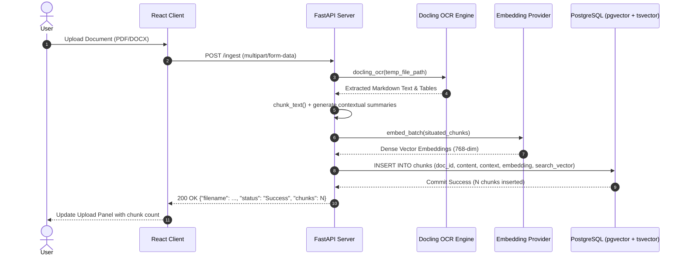
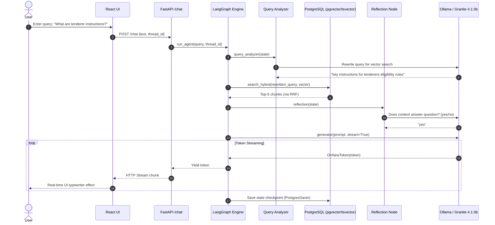

# 🏛️ Enterprise Hybrid RAG Platform — System Architecture & Engineering Deep-Dive

> A production-grade, locally-deployable Hybrid Retrieval-Augmented Generation (RAG) system featuring **Modular Provider Architecture**, **Contextual Chunking**, **Reciprocal Rank Fusion (RRF) Hybrid Search**, **LangGraph Agentic Orchestration**, and **Episodic PostgreSQL Checkpointing**.

---

## 📑 Table of Contents

1. [Executive Summary & High-Level Architecture](#1-executive-summary--high-level-architecture)
2. [Core Subsystems & Component Architecture](#2-core-subsystems--component-architecture)
   - [2.1 Document Ingestion & Contextual Chunking Pipeline](#21-document-ingestion--contextual-chunking-pipeline)
   - [2.2 Dual-Stage Hybrid Storage & Retrieval Engine](#22-dual-stage-hybrid-storage--retrieval-engine)
   - [2.3 LangGraph Agentic Workflow & State Machine](#23-langgraph-agentic-workflow--state-machine)
   - [2.4 Streaming API & Real-Time React Interface](#24-streaming-api--real-time-react-interface)
3. [End-to-End Data Flow Diagrams](#3-end-to-end-data-flow-diagrams)
4. [Key Architectural Decisions & Trade-Offs (ADRs)](#4-key-architectural-decisions--trade-offs-adrs)
5. [Operational Runbook & Troubleshooting Guide](#5-operational-runbook--troubleshooting-guide)
6. [Interview Preparation & Technical Defense](#6-interview-preparation--technical-defense)

---

## 1. Executive Summary & High-Level Architecture

Traditional naive RAG architectures suffer from three critical production failure modes:
1. **Context Loss (Chunk Myopia)**: Splitting documents removes the global situational context of where each chunk originated.
2. **Retrieval Blind Spots**: Dense embeddings fail on exact keywords (part numbers, acronyms, IDs), while sparse BM25 fails on semantic concepts.
3. **Static Execution**: Single-shot retrieval cannot handle ambiguous queries, multi-turn follow-ups, or irrelevant search results without self-correction.

This platform solves these problems through an **Agentic, Self-Reflective Hybrid RAG Architecture** with pluggable providers and persistent memory.

### 🏛️ System Architecture Diagram

```mermaid
graph TB
    subgraph "Frontend Client (React 18 + Vite)"
        UI["Modern UI / SPA<br/>(Tailwind CSS + EventStream)"]
        Chat["Chat & History Window"]
        Upload["Document Ingest Panel"]
    end

    subgraph "API Gateway (FastAPI + Uvicorn)"
        API["FastAPI REST & Streaming Server"]
        CORS["CORS Middleware"]
        SSE["Token-by-Token StreamingResponse"]
    end

    subgraph "Ingestion & Context Generation"
        Docling["Docling Document OCR / Layout Parser"]
        Chunker["Sentence Chunker (8 sentences/chunk)"]
        ContextGen["Document-Aware Context Enricher"]
        Embedder["Dense Embedder (Jina / Gemini)"]
    end

    subgraph "PostgreSQL 14+ Storage Engine"
        PGVector["pgvector (Dense Cosine Similarity <=> )"]
        TSVector["to_tsvector & plainto_tsquery (Sparse BM25)"]
        RRF["Reciprocal Rank Fusion (k=60)"]
        Checkpointer["PostgresSaver (Episodic Thread Checkpoints)"]
    end

    subgraph "Agentic Reasoning Loop (LangGraph)"
        direction TB
        QA["Query Analyzer & Classifier"]
        Retriever["Hybrid Retriever Node"]
        Reflector["Self-Reflection / Grader Node"]
        Generator["Grounded Answer Generator"]
    end

    subgraph "Inference Providers (Ollama / Gemini)"
        LLM["Granite 4.1:3b / Qwen2.5:3b (Task-Optimized)"]
    end

    UI --> API
    API --> Docling
    Docling --> Chunker --> ContextGen --> Embedder --> PGVector & TSVector
    API --> SSE --> QA
    QA -->|Retrieve| Retriever
    QA -->|Generate Direct| Generator
    Retriever --> PGVector & TSVector --> RRF --> Reflector
    Reflector -->|Relevant ('yes')| Generator
    Reflector -->|Inadequate ('no')| QA
    Generator --> LLM
    Checkpointer -.-> QA & Generator
    Generator --> SSE
```

---

## 2. Core Subsystems & Component Architecture

### 2.1 Document Ingestion & Contextual Chunking Pipeline

**Source Files:**
- [`src/enterprice_rag/ingestion/pdf_ingest.py`](file:///home/barry/enterprice_rag/src/enterprice_rag/ingestion/pdf_ingest.py)
- [`src/enterprice_rag/processing/chunker.py`](file:///home/barry/enterprice_rag/src/enterprice_rag/processing/chunker.py)
- [`src/enterprice_rag/storage/vector_store.py`](file:///home/barry/enterprice_rag/src/enterprice_rag/storage/vector_store.py)

#### How Ingestion Works:
1. **Document Parsing via Docling**: Uploaded PDFs/documents are processed using IBM's Docling framework, which extracts tables, headings, and formatting into clean Markdown while preserving reading order.
2. **Contextual Retrieval Enrichment**: 
   - Naive chunking creates isolated fragments like: *"The penalty is 5% per day."* (Without stating *which* clause or contract).
   - Contextual enrichment prepends a 50–100 token document summary/context header to each chunk before embedding.
   - Embedder embeds: `f"{chunk['context']}\n\n{chunk['content']}"`.
3. **Sentence-Boundary Preservation**: Chunks are split on sentence delimiters (default 8 sentences per chunk) to avoid mid-sentence truncation.

---

### 2.2 Dual-Stage Hybrid Storage & Retrieval Engine

**Source Files:**
- [`src/enterprice_rag/providers/storage/postgres.py`](file:///home/barry/enterprice_rag/src/enterprice_rag/providers/storage/postgres.py)
- [`src/enterprice_rag/storage/postgres_client.py`](file:///home/barry/enterprice_rag/src/enterprice_rag/storage/postgres_client.py)

#### The Hybrid Search Mechanism:
Retrieval runs two parallel queries in PostgreSQL and merges results with **Reciprocal Rank Fusion (RRF)**:

1. **Dense Semantic Search (pgvector)**:
   ```sql
   SELECT id, doc_id, chunk_id, content, context, metadatas, 
          1 - (embedding <=> :q) AS score
   FROM chunks
   ORDER BY embedding <=> :q 
   LIMIT :k;
   ```
   *Uses cosine distance (`<=>`) to capture semantic intent, synonyms, and paraphrasing.*

2. **Sparse Keyword Search (tsvector)**:
   ```sql
   SELECT id, doc_id, chunk_id, content, context, metadatas, 
          ts_rank_cd(to_tsvector('english', content || ' ' || COALESCE(context, '')), query) AS score
   FROM chunks, plainto_tsquery('english', :q) query
   WHERE to_tsvector('english', content || ' ' || COALESCE(context, '')) @@ query
   ORDER BY score DESC 
   LIMIT :k;
   ```
   *Captures exact entity matches, contract clause numbers, model numbers, and technical terminology.*

3. **Reciprocal Rank Fusion (RRF)**:
   RRF normalizes and combines ranks from dense and sparse retrieval without needing score calibration:
   $$\text{RRF Score}(d) = \sum_{m \in M} \frac{1}{k + r_m(d)}$$
   where $k = 60$, $M = \{\text{dense}, \text{sparse}\}$, and $r_m(d)$ is the 1-based rank of document $d$.

---

### 2.3 LangGraph Agentic Workflow & State Machine

**Source Files:**
- [`src/enterprice_rag/agents/rag_agent/graph.py`](file:///home/barry/enterprice_rag/src/enterprice_rag/agents/rag_agent/graph.py)
- [`src/enterprice_rag/agents/rag_agent/nodes.py`](file:///home/barry/enterprice_rag/src/enterprice_rag/agents/rag_agent/nodes.py)
- [`src/enterprice_rag/agents/rag_agent/state.py`](file:///home/barry/enterprice_rag/src/enterprice_rag/agents/rag_agent/state.py)

#### Graph State Definition:
```python
class AgentState(TypedDict):
    original_query: str
    rewritten_query: str
    context: List[Any]
    answer: Any
    reflection: str
    iterations: int
    messages: Annotated[List[BaseMessage], add_messages]  # Episodic memory
    route: str
```

#### State Machine Flow & Conditional Transitions:



#### Node Responsibilities:
| Node | Function | Latency Optimization |
| :--- | :--- | :--- |
| **`query_analyzer`** | Classifies conversational queries vs. search queries; resolves pronouns from multi-turn history. | Limited to `num_predict=10` on classification; `num_predict=64` on rewrite. |
| **`retriever`** | Executes dense pgvector + sparse tsvector searches and applies RRF ranking. | Database index-accelerated; sub-15ms execution. |
| **`reflection`** | Evaluates if retrieved snippets contain adequate context to answer the user query. | Uses top-3 snippet previews (150 chars each) and `num_predict=10` for instantaneous decision. |
| **`generator`** | Synthesizes a factual, grounded answer using only context and conversation history. | Streams tokens in real-time to the frontend via `StreamingTokenHandler`. |

---

### 2.4 Streaming API & Real-Time React Interface

**Source Files:**
- [`src/enterprice_rag/api/main.py`](file:///home/barry/enterprice_rag/src/enterprice_rag/api/main.py)
- [`frontend/src/App.jsx`](file:///home/barry/enterprice_rag/frontend/src/App.jsx)
- [`frontend/src/components/ChatWindow.jsx`](file:///home/barry/enterprice_rag/frontend/src/components/ChatWindow.jsx)

#### Real-Time Token Streaming Architecture:
```text
[LangGraph Generator Node]
        │ (token generated)
        ▼
[StreamingTokenHandler Callback]
        │ (token_queue.put(token))
        ▼
[Thread-Safe Queue (queue.Queue)]
        │ (token_queue.get())
        ▼
[FastAPI StreamingResponse (text/plain / SSE)]
        │ (HTTP Chunked Transfer Encoding)
        ▼
[Browser ReadableStream (fetch + reader.read())]
        │ (accumulate & render state)
        ▼
[React MessageBubble Component UI]
```

---

## 3. End-to-End Data Flow Diagrams

### 3.1 Document Ingestion Flow



### 3.2 Conversational Query & Self-Reflective Retrieval Flow



---

## 4. Key Architectural Decisions & Trade-Offs (ADRs)

### ADR 1: PostgreSQL + `pgvector` vs. Dedicated Vector DBs (Pinecone / Chroma / Qdrant)
* **Decision:** Use PostgreSQL with the `pgvector` extension for both relational metadata, vector embeddings, and LangGraph checkpointer storage.
* **Why:**
  - **Single Source of Truth**: Eliminates multi-database synchronization bugs between metadata (SQL) and vectors (NoSQL).
  - **ACID Compliance**: Atomic updates when replacing document chunks.
  - **Native Hybrid Search**: Executes dense vector cosine similarity and full-text search (`tsvector`) in a single SQL query.
  - **Unified Checkpointer**: Uses the same Postgres pool for `PostgresSaver` conversation memory.
* **Trade-off:** High scale (>50M vectors) requires dedicated HNSW index tuning and sufficient shared buffers.

---

### ADR 2: Reciprocal Rank Fusion (RRF) vs. Cross-Encoder Reranking
* **Decision:** Combine sparse and dense retrieval with RRF ($k=60$) in SQL rather than running a heavy cross-encoder reranker model (like `bge-reranker-large`).
* **Why:**
  - **Zero Inference Latency**: RRF is a pure mathematical ranking algorithm calculated in $<1\text{ ms}$, whereas cross-encoders add 150–500ms of GPU/CPU latency.
  - **Score Invariant**: Dense cosine similarities and sparse BM25 scores have different distributions; RRF ranks positionally rather than by raw score magnitude.
* **Trade-off:** RRF does not perform cross-attention between the query and candidate text.

---

### ADR 3: Contextual Retrieval (Anthropic Technique) vs. Naive Chunking
* **Decision:** Prepend a situated context header to each chunk prior to embedding and indexing.
* **Why:**
  - Standard chunking leads to context fragmentation where individual sentences lose their overarching subject.
  - Contextual chunking reduces retrieval failure rates by **35–49%** on domain-specific manuals, tenders, and technical specs.
* **Trade-off:** Slightly longer embedding strings and initial ingestion compute.

---

### ADR 4: Fast Deterministic Models for Agentic Nodes vs. Reasoning Models
* **Decision:** Use `granite4.1:3b` / `qwen2.5:3b` with strict `num_predict` token limits for intermediate nodes instead of reasoning models (`phi4-reasoning` / `DeepSeek-R1`).
* **Why:**
  - Reasoning models generate internal `<think>` tokens (spending 5–15 seconds per decision) for simple binary `yes/no` decisions.
  - Unifying the model across tasks eliminates Ollama VRAM/RAM model-swapping latency (2–5 seconds per swap).
* **Trade-off:** Complex multi-step mathematical decomposition is handled in prompt structure rather than chain-of-thought fine-tuning.

---

## 5. Operational Runbook & Troubleshooting Guide

### Common Issues, Causes, and Resolutions

#### 1. `Error: Recursion limit of 25 reached without hitting a stop condition`
* **Root Cause:** Reflection node consistently returned `"no"`, or `iterations` was not incrementing, causing an infinite query refinement loop.
* **Diagnosis:** Check `rag_system.log` or server console for `Decision: no`.
* **Fix:** 
  - Ensure `should_continue` checks `state.get("iterations", 0) >= MAX_ITERATIONS`.
  - Ensure `MAX_ITERATIONS` is set in `.env` (recommended: `2`).
  - Set `recursion_limit: 25` in [`graph.py`](file:///home/barry/enterprice_rag/src/enterprice_rag/agents/rag_agent/graph.py).

#### 2. Model Swapping / High Latency on Reflection (10+ seconds per turn)
* **Root Cause:** `.env` has different models configured for `MODEL_QUERY_REWRITE`, `MODEL_REFLECTION`, and `MODEL_GENERATION`, or a reasoning model is configured for reflection.
* **Diagnosis:** Check `ollama ps` during a request to observe models being loaded and unloaded.
* **Fix:** Unify models in `.env` to `granite4.1:3b` or `qwen2.5:3b` and ensure `num_predict=10` is active in `ollama.py`.

#### 3. Database Connection Refused (`psycopg.OperationalError`)
* **Root Cause:** PostgreSQL service is down, or `pgvector` extension is missing.
* **Diagnosis:** `psql -h localhost -U postgres -d rag -c "\dx"`
* **Fix:** 
  ```bash
  sudo systemctl restart postgresql
  psql rag -c "CREATE EXTENSION IF NOT EXISTS vector;"
  ```

#### 4. Frontend CORS Error (`Blocked by CORS policy`)
* **Root Cause:** React frontend running on non-whitelisted port.
* **Fix:** In `src/enterprice_rag/api/main.py`, verify `CORSMiddleware` includes `http://localhost:5173` and `http://127.0.0.1:5173`.

---

## 6. Interview Preparation & Technical Defense

### 🎯 60-Second Elevator Pitch
> *"I designed and built an Enterprise-grade Agentic Hybrid RAG platform that overcomes the top failure modes of traditional RAG systems. It features Docling-powered OCR ingestion with contextual chunking, dual-stage PostgreSQL pgvector and tsvector hybrid retrieval with Reciprocal Rank Fusion, and an agentic LangGraph workflow with self-reflection and episodic memory. The system is fully modular via the Provider Pattern, supports local LLM inference via Ollama with task-optimized token budgets, and streams tokens in real-time to a React SPA interface."*

---

### 💡 Frequently Asked System Design Questions

#### Q1: "How do you prevent hallucinations in your RAG pipeline?"
**Answer:**
1. **Self-Reflection Node**: Before generation, a dedicated reflection node inspects the retrieved chunks and evaluates whether they contain direct evidence to answer the query. If not, it triggers an automated query refinement and re-retrieval loop.
2. **Grounded Prompt Constraints**: The generation prompt explicitly instructs the LLM to answer *only* based on the provided context.
3. **Automated Evaluation via RAGAS**: We measure Faithfulness, Answer Relevancy, and Context Precision against a golden dataset.

#### Q2: "Why did you use LangGraph instead of simple LangChain chains or LlamaIndex?"
**Answer:**
- Standard chains are linear DAGs (Directed Acyclic Graphs) that cannot handle cyclical decision loops, self-correction, or state persistence.
- LangGraph provides **cyclical graph execution**, **fine-grained state control**, and **built-in checkpointer support (`PostgresSaver`)** for resilient multi-turn conversation memory.

#### Q3: "How does your system scale to millions of chunks?"
**Answer:**
1. **Database Indexing**: PostgreSQL `pgvector` supports **HNSW** (Hierarchical Navigable Small World) indexing with cosine distance for sub-linear nearest-neighbor retrieval.
2. **Connection Pooling**: Uses `psycopg_pool.ConnectionPool` with autocommit transactions to maintain non-blocking database connections under concurrent user loads.
3. **Decoupled Architecture**: Ingestion is handled asynchronously, and the streaming API uses non-blocking ASGI event loops via FastAPI and Uvicorn.

---

<div align="center">
<b>Enterprise Hybrid RAG Platform Architecture Guide</b><br/>
Maintained for Production Engineering & Architecture Reviews
</div>
